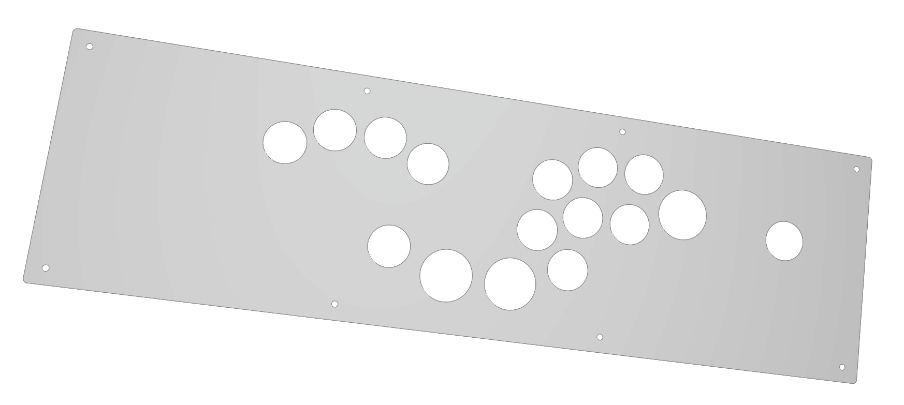
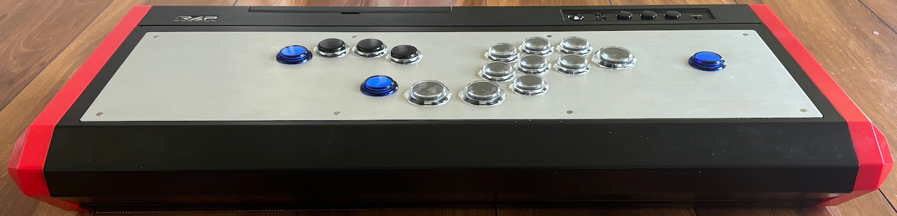
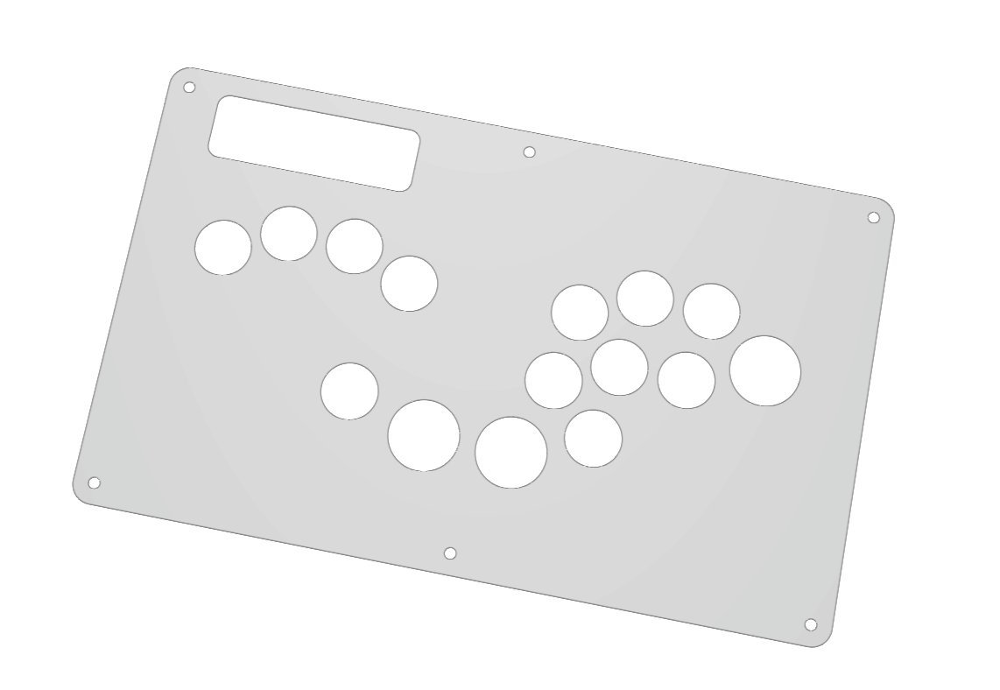
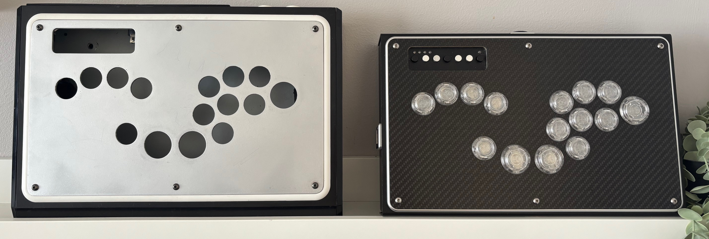
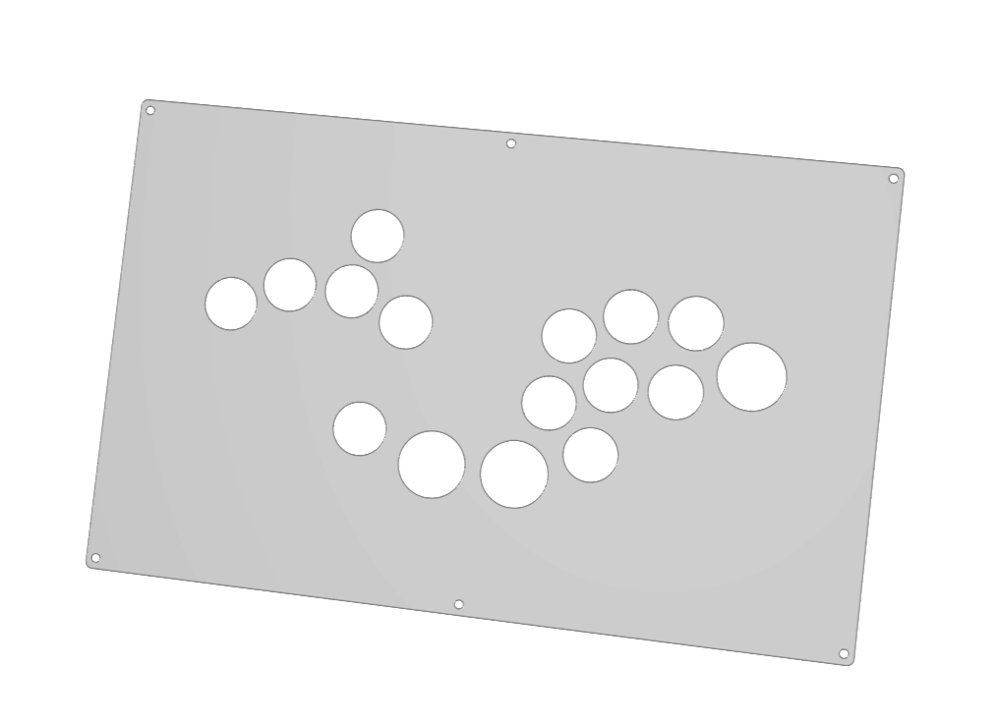
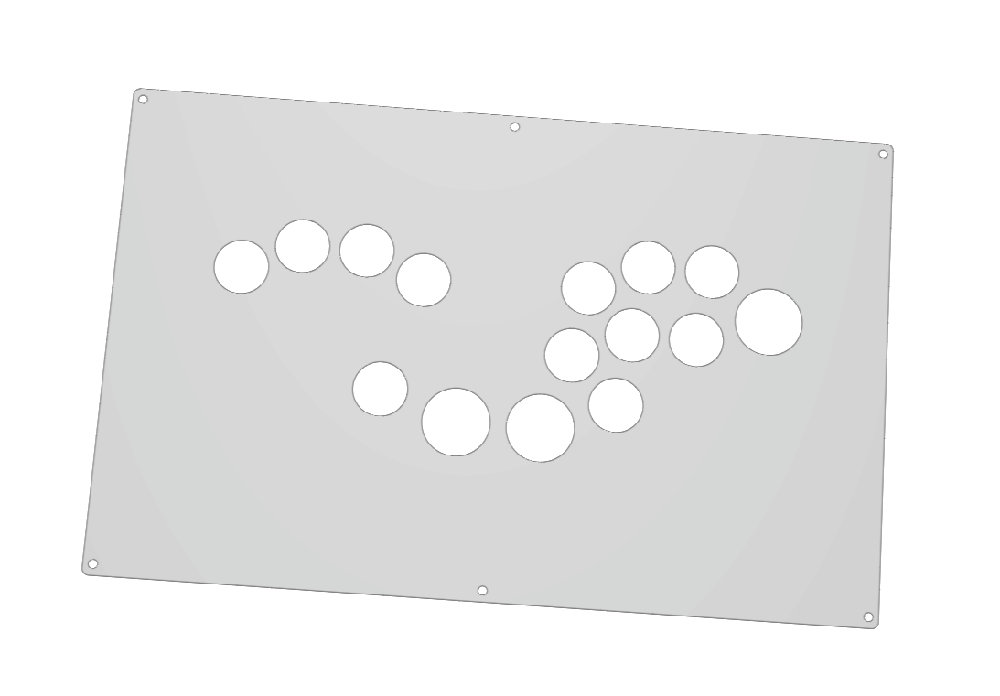

# Leverless Custom Layouts

Each DXF file is ready for laser cut at sendcutsend.com.

## Hori VLX Custom Layouts

### standard Split Layout

##### Filename: hori_vlx_split_standard.dxf

### Ultrawide Split with Left Pinky

##### Filename: hori_vlx_split_ultrawide_left_pinky.dxf

### Ultrawide Split without Left Pinky

##### Filename: hori_vlx_split_ultrawide_no_left_pinky.dxf

## Mad Catz TE1

##### Filename:  te1_split_standard.dxf

## Mad Catz TE2

Also compatible with Panzer 4, but you need to cut part of the case to make room for the two thumb buttons.

##### Filename:  te2_split_wasd.dxf

##### Filename:  te2_split_standard.dxf

